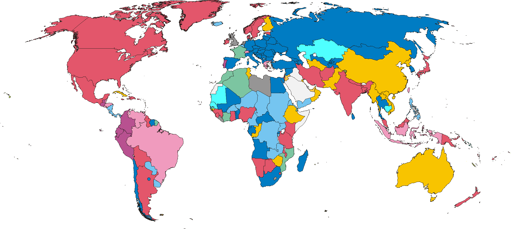

***

# geospacial-plot

[binder_lab]: https://mybinder.org/v2/gh/EmanuelFontelles/geospacial-plot.git/master

> This repo is developed by [Emanuel Fontelles](https://github.com/emanuelfontelles).
>
> Some notebooks to understand how to use Plot.ly and geopandas

## Project philosophy

Many excellent plotting libraries exist in Python, including the main ones:

* [Matplotlib](http://matplotlib.org/)
* [Bokeh](http://bokeh.pydata.org/en/latest/)
* [Seaborn](http://stanford.edu/~mwaskom/software/seaborn/#)
* [Lightning](http://lightning-viz.org/)
* [Plotly](https://plot.ly/)
* [Pandas built-in plotting](http://pandas.pydata.org/pandas-docs/stable/visualization.html)

Each library does a particular set of things well.

## Table of Contents
<!--NAVIGATION-->
- [Starting with Plot.ly](geomaps_01.ipynb)
- [Choropleth Graphs](geomaps_01.ipynb)
- [Create choropleth from csv e pandas](geomaps_02.ipynb)
- [Geospatial Data Analysis, Geojsonio and Geopandas](geomaps_03.ipynb)
- [Geopandas from documentation](geopandas.ipynb)
- [Creating a GeoDataFrame from a DataFrame](create_geopandas_from_pandas.ipynb)
- Kernel Density Estimation
  - [KDE Algorithm](./kde/kdeMethod1.ipynb)
  - [KDE Seaborn](./kde/kdeMethod2.ipynb)
  - [KDE Scikit-Learn](./kde/kdeMethod3.ipynb)

## Usage

Click in the Binder bagde [][binder_lab] to play with the notebooks from your
browser without installing anything.

For a local installation, you will need [git], [Python], and packages from the
[Python scientific stack][scipy]. If you don't know how to install those on
your platform, we recommend to install [Miniconda], a distribution of the
[conda] package and environment manager. Please follow the below instructions
to install it and create an environment for the course.

1. Download the Python 3.x installer for Windows, macOS, or Linux from
   <https://conda.io/miniconda.html> and install with default settings. Skip
   this step if you have conda already installed (from [Miniconda] or
   [Anaconda]). Linux users may prefer to use their package manager.
   * Windows: Double-click on the `.exe` file.
   * macOS: Run `bash Miniconda3-latest-MacOSX-x86_64.sh` in your terminal.
   * Linux: Run `bash Miniconda3-latest-Linux-x86_64.sh` in your terminal.
1. Open a terminal. Windows: open the Anaconda Prompt from the Start menu.

Every time you want to work, do the following:

1. Open a terminal. Windows: open the Anaconda Prompt from the Start menu.
1. Start Jupyter with `jupyter notebook` or `jupyter lab`. The command should
   open a new tab in your web browser.
1. Edit and run the notebooks from your browser.

[git]: https://git-scm.com
[python]: https://www.python.org
[scipy]: https://www.scipy.org
[anaconda]: https://www.anaconda.com/download/
[miniconda]: https://conda.io/miniconda.html
[conda]: https://conda.io
[conda-forge]: https://conda-forge.org

## Disclaimer
This is a personal repository that is not meant for public use at this time. It is provided "as is", without warranty of any kind, express or implied, including but not limited to the warranties of merchantability, fitness for a particular purpose, and noninfringement. No installation or technical support will be provided.
